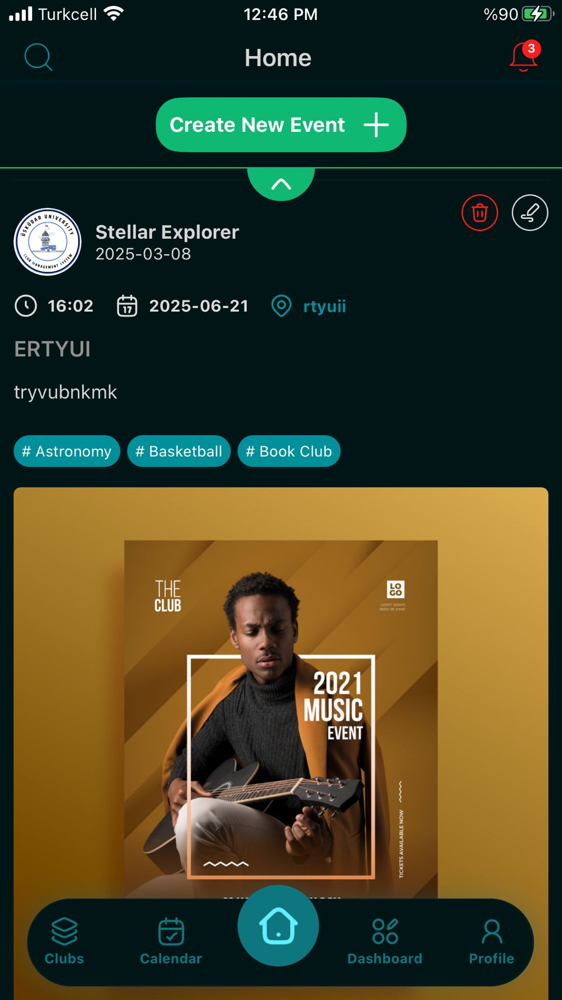
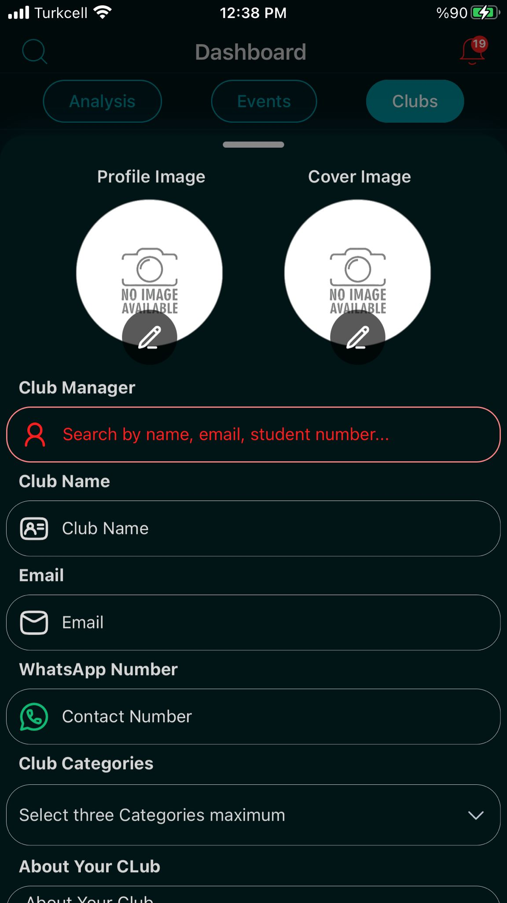
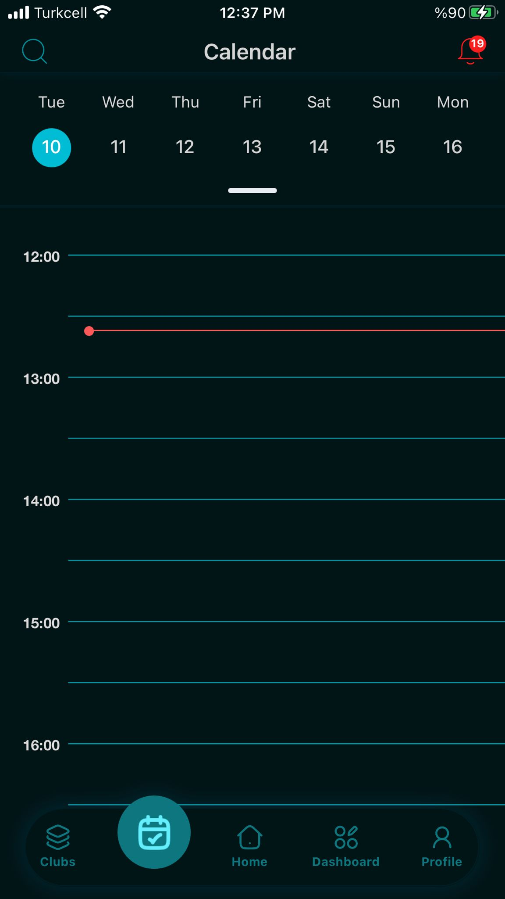
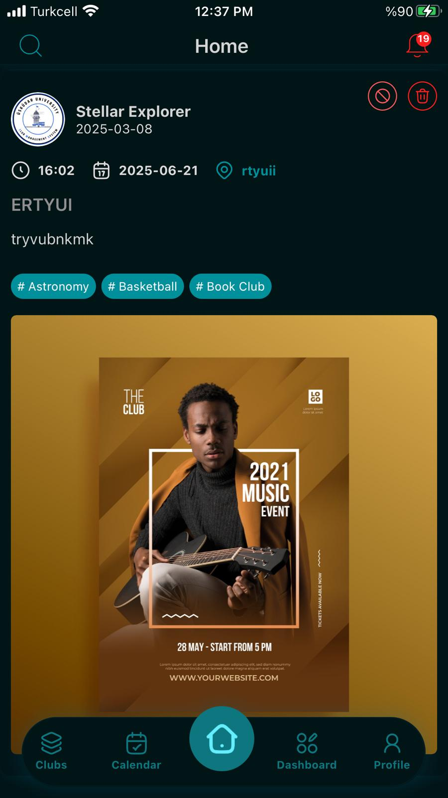

# ReactNativeClubMS

## Overview
ReactNativeClubMS is a robust mobile application built with React Native, designed to streamline club and event management. This project, developed as a final-year graduation project, offers a seamless experience for both administrators and users to manage club activities, events, and user interactions efficiently.

## Screenshots
<table>
  <tr>
    <td></td>
    <td></td>
    <td></td>
  </tr>
  <tr>
    <td></td>
    <td></td>
    <td></td>
  </tr>
  <tr>
    <td></td>
    <td></td>
    <td></td>
  </tr>
  <tr>
    <td></td>
    <td></td>
    <td></td>
  </tr>
  <tr>
    <td></td>
    <td></td>
    <td></td>
  </tr>
  <tr>
    <td></td>
    <td></td>
    <td></td>
  </tr>
  <tr>
    <td></td>
    <td></td>
    <td></td>
  </tr>
  <tr>
    <td></td>
    <td></td>
    <td></td>
  </tr>
  <tr>
    <td></td>
    <td></td>
    <td></td>
  </tr>
  <tr>
    <td></td>
    <td></td>
    <td></td>
  </tr>
  <tr>
    <td></td>
    <td></td>
    <td></td>
  </tr>
  <tr>
    <td></td>
    <td></td>
    <td></td>
  </tr>
  <tr>
    <td></td>
    <td></td>
    <td></td>
  </tr>
  <tr>
    <td></td>
    <td></td>
    <td></td>
  </tr>
  <tr>
    <td></td>
    <td></td>
    <td></td>
  </tr>
  <tr>
    <td></td>
    <td></td>
    <td></td>
  </tr>
  <tr>
    <td></td>
    <td></td>
    <td></td>
  </tr>
  <tr>
    <td></td>
    <td></td>
    <td></td>
  </tr>
  <tr>
    <td></td>
    <td></td>
    <td></td>
  </tr>
  <tr>
    <td></td>
    <td></td>
    <td></td>
  </tr>
  <tr>
    <td></td>
    <td></td>
  </tr>
</table>

## Features
- **User Authentication**: Secure login and registration powered by JWT authentication.
- **Bottom Tab Navigation**: Smooth and animated navigation for an intuitive user experience.
- **Profile Management**: Users can view and edit their profiles with ease.
- **Club & Event Management**: Access detailed club information, upcoming events, and schedules.
- **Admin Dashboard**: Comprehensive oversight of clubs, members, and event statistics.
- **Animated UI Components**: Enjoy smooth transitions and interactions for an enhanced user experience.

## Technologies Used
- **React Native**: Cross-platform mobile development framework.
- **Expo**: Simplified app building and testing environment.
- **React Navigation**: Stack and tab-based navigation for seamless user flow.
- **AsyncStorage**: Persistent user authentication data storage.
- **Axios**: Efficient API communication for user authentication and data fetching.
- **Reanimated**: Smooth UI animations for an enhanced user experience.
- **JWT Authentication**: Secure user sessions and data protection.

## Project Architecture
The project is structured into several key directories:
- **`app/`**: Contains the main application screens and components.
- **`api/`**: Houses API-related code, including Firebase configuration and API calls.
- **`component/`**: Reusable UI components used throughout the application.
- **`contexts/`**: React Context providers for state management.
- **`navigators/`**: Navigation configuration for the app.
- **`services/`**: Business logic and service-related code.
- **`util/`**: Utility functions and helpers.
- **`assets/`**: Static assets like images and fonts.

## Key Components
- **`MainApp.js`**: The entry point of the application, handling authentication and initial setup.
- **`App.js`**: Root component for the application.
- **`PrivateRoute/`**: Manages protected routes and authentication checks.
- **`navigators/`**: Contains stack and tab navigators for seamless navigation.

## Backend Integration
This mobile app integrates with a robust Spring Boot backend, which provides secure RESTful APIs for club and event management. The backend repository can be found at [CMS_Spring_Backend](https://github.com/habeebFayez/CMS_Spring_Backend.git).

### Backend Features
- Club creation, editing, and management
- User roles: Admin, Manager, Student
- Event management for clubs
- Category and membership management
- JWT-based authentication and authorization
- Firebase push notifications
- MySQL database integration
- Secure environment variable configuration
- RESTful API endpoints

### Backend Tech Stack
- Java 11
- Spring Boot 2.6+
- Spring Security (JWT)
- MySQL
- Firebase Admin SDK
- Maven

### Backend Setup
1. **Clone the backend repository:**
   ```sh
   git clone https://github.com/habeebFayez/CMS_Spring_Backend.git
   cd CMS_Spring_Backend
   ```
2. **Configure environment variables:**
   - Create a `.env` file in the project root with the following variables:
     ```env
     DB_URL=jdbc:mysql://localhost:3306/your_db_name
     DB_USERNAME=your_db_user
     DB_PASSWORD=your_db_password
     JWT_SECRET=your_jwt_secret
     JWT_EXPIRATION=86400000
     FIREBASE_CONFIG_PATH=src/main/resources/your-firebase-adminsdk.json
     ```
   - Ensure `.env` is **not** committed to version control.
3. **Install dependencies:**
   ```sh
   mvn clean install
   ```
4. **Run database migrations** (if any).
5. **Start the backend server:**
   ```sh
   mvn spring-boot:run
   ```
   The server will start on `http://localhost:8080` by default.

### API Integration
- All endpoints are prefixed with `/api/`
- JWT authentication is required for protected routes
- Example endpoints:
  - `POST /api/club/createClub` — Create a new club
  - `PUT /api/club/editClub` — Edit club details
  - `GET /api/club/getAllClubs` — List all clubs
  - `POST /api/auth/login` — User login

## Installation
1. Clone the repository:
   ```sh
   git clone https://github.com/habeebFayez/club_management_system_MobileApp.git
   ```
2. Navigate to the project directory:
   ```sh
   cd club_management_system_MobileApp
   ```
3. Install dependencies:
   ```sh
   npm install
   ```
4. Start the development server:
   ```sh
   npm start
   ```

## Usage
- **User Authentication**: Log in or register to access the app.
- **Club Management**: View and manage club details and events.
- **Admin Dashboard**: Oversee clubs, members, and event statistics.

## Future Enhancements
- Push Notifications for Events
- Dark Mode Support
- Club Membership Requests
- Offline Data Storage

## Contributions
This project is part of my graduation project. Contributions, issues, and feature requests are welcome!

## License
This project is licensed under the MIT License - see the LICENSE file for details.

## Contact
For questions or support, contact [habeeb.fayez@gmail.com](mailto:habeeb.fayez@gmail.com).

